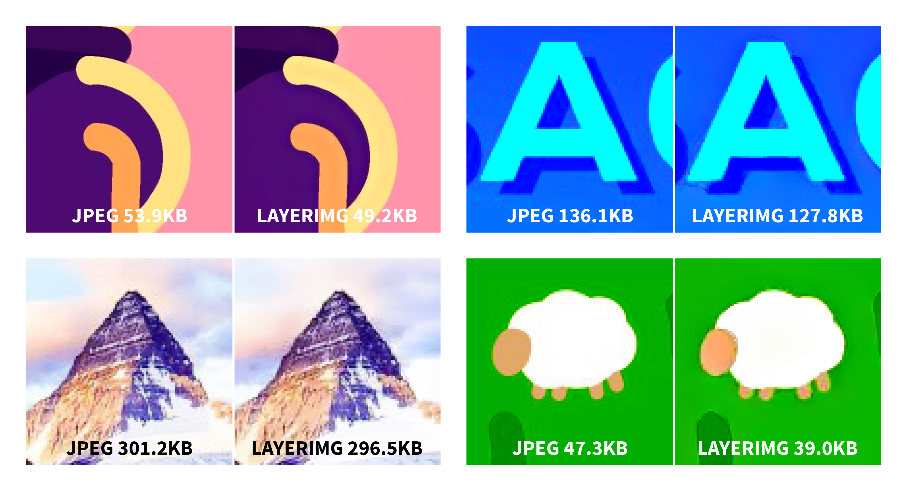

# layerimg
An experiment on using AI upscaling for image compression

> If AI upscaling can magically restore the resolution and quality of images,
> why don't we just save space by reducing the quality of the image and use upscaling to restore it later?

That's what I'm trying to do in this project, with limited success. Here are some of the results:

## dependencies
I built this project on [Python](https://www.python.org/downloads) 3.9.6 and [Pillow](https://pillow.readthedocs.io/en/stable/installation.html) 8.4.0. It should work on other versions too, please create a pull request if you have any problem.

## usage
**`main.py`** provides the interface for you to use in a command-line, run `python main.py --help` or `python main.py <command> --help` for the full help message.
Here are the main commands:

- **`compress`** Compresses an image into an archive, e.g.,  
`python main.py compress input/landscape.png output/landscape.zip`

- **`extract`** Extracts image from an archive, e.g.,  
`python main.py extract output/landscape.zip output/landscape.png`

- **`test`** Compresses an image and then extracts to compare the result, e.g.,  
`python main.py test input/landscape.png output/landscape.zip --create-jpeg`  
The `--create-jpeg` switch tells `main.py` to create a JPG file of similar size to the layerimg archive to compare

- **`batch`** Compresses, extracts, or tests multiple files sequentially, e.g.,  
`python main.py batch compress input/landscape.png input/kurzgesagt.png`  
`python main.py batch extract output/landscape.zip output/kurzgesagt.zip`
